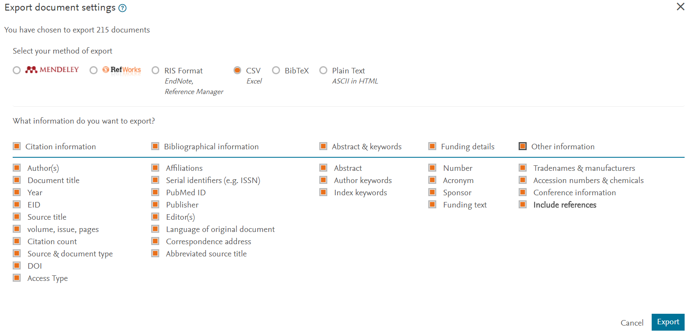

# OpenPaleo

Resources to investigate the 'openness' of Paleontological research.

## Project concept

The idea of this project is to perform a range of meta-analyses into the published Palaeontology literature. This will include looking at factors such as:

- Quantitative analysis of the 'openness' of Palaeontology research
- Citation frequences for different journals, compared to their impact factors
- How aware researchers are that they may have signed away copyright

We strongly encourage others to participate in the project, propose their own ideas, and to contribute or re-use any of the data or other information available here.

## Data sources

### Google Scholar

Journal selection was for the top-20 cited Paleontology journals according to [Google Scholar](https://scholar.google.com/citations?view_op=top_venues&hl=en&vq=soc_paleontology). 

### Scopus

Metadata were extracted from Scopus journal-by-journal (as csv files), with the only filter being on the dates, constrained to published articles between 2015-2016. This includes information such as:

- Authors, titles, and year of publication
- Number of citations (according to Scopus)
- Article Digital Object Identifier (DOI)

#### A little hiccup

Note that there was an issue here with encoding of the csv exports from Scopus. This displaced some of the cells when viewed in Excel, so the delimiting was fixed for each file were needed to realign the cells properly. This was done simply be converting them to text, opening back up in Excel, specfying explicitly that commas were the delimiter and using UTF-8 encoding. After this, the files could be re-saved in csv format as needed.

### Unpaywall

The next phase is to use the [Unpaywall DOI checker](https://unpaywall.org/check-dois) on the DOI list for each journal. This provides information such as:

- The Open Access state (true or false)
- Publication date
- Source of evidence for Open Access status

All of the results of these steps are available within this [repository](https://github.com/Meta-Paleo/OpenPaleo/tree/master/Journal%20data).

### Author survey

These data will be supplemented by conducting an author survey, built in Google Forms. Suggestions for this survey will be supplemented using an open system through GitHub here.

The following aspects will be looked at, where applicable.

- Open Access status 
- Article Processing Charge
- If a self-archived version is available
- Article license
- Code availabaility and license
- Data availabilty and license
- Whether a new taxon was named
- Whether new taxa have PIDs (via ZooBank)
- Whether specimens analysed are archived in a public reposiitory/museum
- What the copyright status of articles is

Results will be reported anonymously, and available for inspection and reuse.

## Communications

The intention is to port this project into the Open Science Framework, and then to paleorXiv as a preprint submission. Whether or not it will be submitted to a peer reviewed journal is unknown for now.

## Limitations

The journal selection choice explicitly excludes multi-disciplinary Open Access journals such as PeerJ, PLOS ONE, and Scientific Reports, which palaeontologists also frequently publish in.